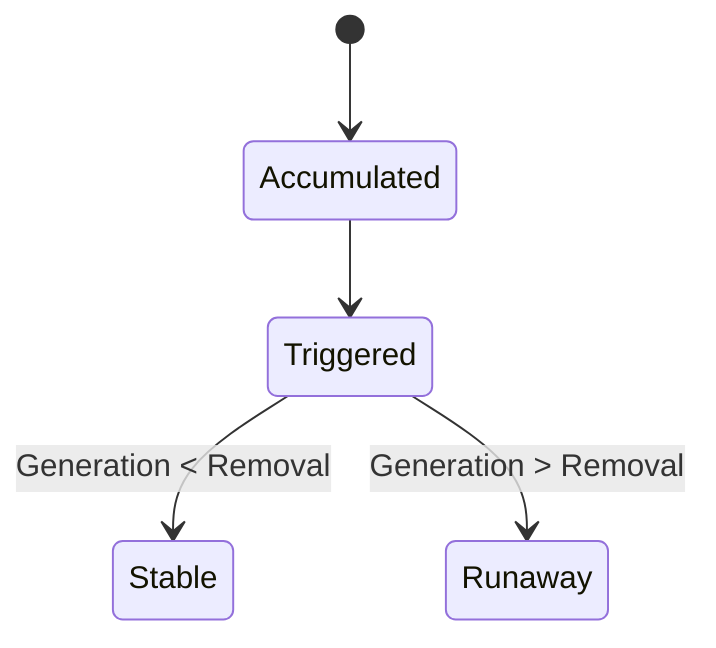

# CHG-001 Charging Sequence — Risk Envelope (Not a Gate)

## 1. Positioning

This file identifies **charging sequences that are structurally disadvantaged during scale-up**.  
It is **not** a yes/no gate, but a **risk amplification indicator layer**.

- Some sequences may *survive* under specific conditions  
- They should not be treated as default choices  
- When adopted, their **validity conditions and failure boundaries** must be clearly stated

---

## 2. Sequence Risk Patterns

### P1 | Secondary reaction between pre-charged material and product/intermediate

**Description**  
A material is charged early and remains in the reactor; the subsequently formed product or intermediate can react with this pre-charged material.

**Scale-up mechanism**  
Longer addition times and limited local mixing extend the effective co-existence time at non-negligible concentration.

**Survive conditions**  
Secondary reaction kinetics are extremely slow; or subsequent feeds are added sufficiently fast with verified mixing.

---

### P2 | Solids introduced before the system is physically ready (physical decoupling)

**Description**  
Solids are charged before liquid level, wetting, dispersion, or dissolution conditions are established.

**Scale-up mechanism**  
Dead volumes (discharge ports, valves) may trap solids, leading to physical decoupling, delayed dissolution, or delayed reaction.

**Survive conditions**  
Decoupled fraction is negligible; dissolution is extremely fast; or equipment geometry has been verified to have no effective “solid traps”.

---

### P3 | Accumulate first, then trigger (Accumulation → Trigger)

**Description**  
Most or all reactants are charged first; the reaction is initiated later by heating, activation, or catalyst addition.

**Structural scale-up risks**
- Reactive inventory is formed before triggering  
- After triggering, **feed rate as a control lever is lost**  
- With heat or gas generation, safety relies entirely on equipment removal capacity

**Survive window**  
Heat release is very weak and temperature-insensitive; or reaction initiation is smooth; and no significant gas evolution is present.

---

## 3. P3 Structural Logic (Minimal State Representation)

---

## 4. Empirical Thermal Screening for P3 (v0.1)

### 4.1 Geometric scale-up note (A/V collapse)

Lab-scale vessels (glass bottles) have high surface-area-to-volume ratios and favorable heat dissipation.  
Scale-up reactors (cylindrical, high fill) exhibit significantly reduced A/V.

**Conclusion**  
Lack of observable temperature rise at lab scale does **not** imply a thermally benign reaction; heat release may be masked by favorable geometry.

---

### 4.2 Core metric: sliding-window temperature rise (key definition)

**Definition**

- **ΔT₁₅,max**: the **maximum net temperature increase observed over any continuous 15-minute time window** during the entire reaction
    

Notes:

- This is a **sliding window** definition
    
- It is **not** the temperature rise in the first fixed 15 minutes after reaction start
    
- It captures rapid acceleration at **any stage** of the reaction
    

---

### 4.3 Empirical thresholds (lab scale ~0.5–1 L)

**Experience-based thresholds (v0.1, subject to revision)**

- **ΔT₁₅,max ≥ 3 °C**  
    → Risk indication (clear scale-up sensitivity)
    
- **ΔT₁₅,max ≥ 6 °C**  
    → High-risk indication (priority candidate for sequence change, staged addition, or validation)
    

**Interpretation**

- Thresholds are **risk triggers**, not linear temperature conversions
    
- Once exceeded, scale-up risk increases nonlinearly
    

---

### 4.4 Observation conditions

Thresholds should be evaluated under:

- Normal laboratory temperature control
    
- Stable agitation
    
- Consistent probe placement
    

Otherwise, the signal should be treated as weak.

---

## 5. Justified Exception: Pd-Catalyzed Coupling

**Typical sequence**  
Substrates / base / solvent → deoxygenation → catalyst added last

**Rationale**  
Oxygen sensitivity takes precedence over accumulation risk.

**Failure boundary**  
If unusually high reaction rate or significant heat release is observed, reassess sequence, concentration, or catalyst loading.

---

## 6. Usage Notes

- This is an **open structural document**
    
- Thresholds are experience-based (v0.1) and may be revised
    
- The goal is **early identification of scale-up sensitivity**, not final safety judgement