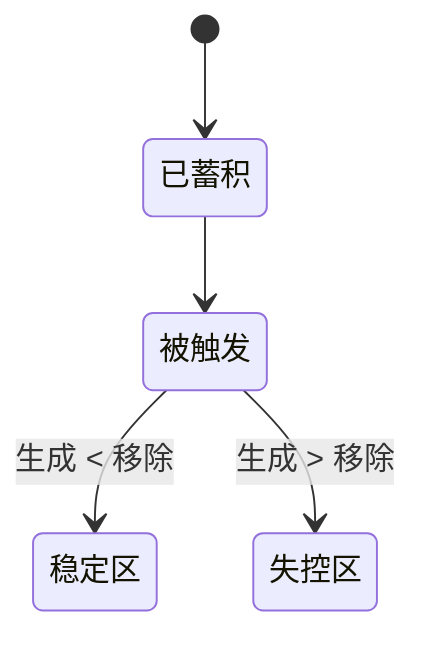

---

snapshot_id: "CHG-001-CHARGING-SEQUENCE"  
status: "draft"  
domain: "Process"  
process: "Charging"  
topic: "投料顺序的风险区间（开放式，非 Gate）"  
level: "001"  
note: "开放式风险结构文件；阈值与模式允许随经验修订。"  
dependencies:

- "CHG-002-ADDITION-MODE-AND-RATE"
    
- "MIX-001-MIXING-ESTABLISHMENT"
    
- "TMP-001-THERMAL-AND-GAS-RISK"
    
- "MAT-001-FEED-EQUIVALENCE"
    

---

# CHG-001 投料顺序 —— 风险区间（非 Gate）

## 1. 定位

本文件用于标识**在放大过程中结构上处于劣势的投料顺序**。  
它不是 yes / no 的 gate，而是**风险放大提示层**。

- 某些顺序在特定条件下可以 _Survive_
    
- 但不应作为默认方案
    
- 采用时应能说明其**成立条件与失效边界**
    

---

## 2. 顺序风险原型（Patterns）

### P1｜先投物料与产物 / 中间体二次反应

**描述**  
某物料先加入并长期存在；后生成的产物或中间体可与其发生二次反应。

**放大机制**  
加料时间拉长 + 局部混合受限 → 有效共存时间显著增加。

**Survive 条件**  
二次反应动力学极慢；或后续加料足够快且混合已验证。

---

### P2｜体系未就绪即投固体（物理脱耦）

**描述**  
在液位、润湿、分散或溶解条件未建立前引入固体。

**放大机制**  
设备死体积（放料口、阀门）→ 固体脱耦、迟发溶解或迟发反应。

**Survive 条件**  
脱耦比例可忽略；溶解极快；或设备已验证无“固体陷阱”。

---

### P3｜先蓄积、后触发（Accumulation → Trigger）

**描述**  
大部分或全部物料先加入，随后通过升温 / 活化 / 加催化剂启动反应。

**放大风险结构**

- 触发前形成反应物库存
    
- 触发后**失去加料速率这一控制杠杆**
    
- 放热 / 放气时，安全性完全依赖设备移除能力
    

**Survive 区间**  
放热极弱且对温度不敏感；或反应启动平缓；且无显著放气。

---

## 3. P3 结构逻辑（最小状态）

---

## 4. P3 放热风险的经验筛选（v0.1）

### 4.1 几何放大提示（A/V）

小试（玻璃瓶）A/V 高、散热有利；  
放大釜（柱形、高装料）A/V 显著下降。

**结论**  
小试无明显温升 ≠ 反应温和；可能仅被几何散热掩盖。

---

### 4.2 核心指标：滑动窗口温升（关键定义）

**定义**

- **ΔT₁₅,max**：在整个反应过程中，  
    **任意连续 15 分钟时间窗内的最大净温升**
    

说明：

- 该定义为**滑动窗口（sliding window）**，  
    而非“反应开始后固定 15 分钟”的温升
    
- 用于捕捉反应过程中**任一阶段**可能出现的快速加速行为
    

---

### 4.3 经验阈值（实验室小试约 0.5–1 L）

**经验阈值（v0.1，可修订）**

- **ΔT₁₅,max ≥ 3 °C**  
    → 风险提示（存在明显放大敏感性）
    
- **ΔT₁₅,max ≥ 6 °C**  
    → 高风险提示（优先考虑改顺序 / 分段加料 / 验证）
    

**解释**

- 阈值为**风险触发信号**，而非线性温升换算
    
- 一旦超过，放大风险等级呈非线性跃迁
    

---

### 4.4 观测条件

阈值应在以下条件下评估：

- 常规实验室控温
    
- 搅拌稳定
    
- 温度探头位置一致
    

否则仅作为弱信号。

---

## 5. 正当例外：Pd 催化偶联

**常见顺序**  
底物 / 碱 / 溶剂 → 脱氧 → 最后加催化剂

**合理性**  
氧敏感性优先于蓄积风险。

**失效边界**  
若出现高速率或明显放热，应重新评估顺序、浓度或催化剂用量。

---

## 6. 使用说明

- 本文件为**开放式结构文档**
    
- 阈值为经验性（v0.1），允许修订
    
- 目标是**提前识别放大敏感性**，非安全结论