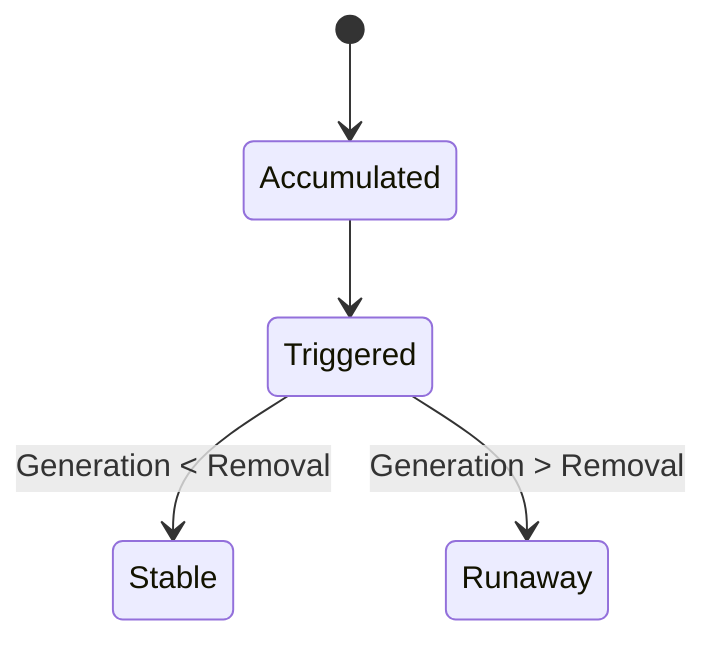

# CHG-001 Charging Sequence — Risk Envelope (Not a Gate)

## 1. Positioning

This file identifies **charging sequences that are structurally disadvantaged during scale-up**.  
It is **not** a yes/no gate, but a **risk amplification indicator layer**.

- Some sequences may *survive* under specific conditions  
- They should not be treated as default choices  
- When adopted, their **validity conditions and failure boundaries** must be clearly stated

### 1.1 Implicit Assumption: Effective Mixing State

All charging-sequence discussions in this document assume that an effective mixing state is established at the time of addition.

Specifically, added materials are assumed to enter the reaction mass and participate in bulk mixing within the charging time scale, rather than being locally retained, deposited, physically decoupled, or diverted into inactive volumes (e.g., dead zones or valve cavities).

If this assumption is violated, sequence-based risk analysis is no longer applicable.  
The failure mode should instead be treated as an effective-entry or local-retention problem and addressed in CHG-002 or subsequent chapters.

---

## 2. Sequence Risk Patterns

### P1 | Secondary reaction between pre-charged material and product/intermediate

**Description**  
A material is charged early and remains in the reactor; the subsequently formed product or intermediate can react with this pre-charged material.

**Scale-up mechanism**  
Longer addition times and limited local mixing extend the effective co-existence time at non-negligible concentration.

**Survive conditions**  
Secondary reaction kinetics are extremely slow; or subsequent feeds are added sufficiently fast with verified mixing.

---

### P2 | Solids introduced before the system is physically ready (physical decoupling)

**Description**  
Solids are charged before liquid level, wetting, dispersion, or dissolution conditions are established.

**Scale-up mechanism**  
Dead volumes (discharge ports, valves) may trap solids, leading to physical decoupling, delayed dissolution, or delayed reaction.

**Survive conditions**  
Decoupled fraction is negligible; dissolution is extremely fast; or equipment geometry has been verified to have no effective “solid traps”.

---

### P3 | Accumulate first, then trigger (Accumulation → Trigger)

**Description**  
Most or all reactants are charged first; the reaction is initiated later by heating, activation, or catalyst addition.

**Structural scale-up risks**
- Reactive inventory is formed before triggering  
- After triggering, **feed rate as a control lever is lost**  
- With heat or gas generation, safety relies entirely on equipment removal capacity

**Survive window**  
Heat release is very weak and temperature-insensitive; or reaction initiation is smooth; and no significant gas evolution is present.

---
### P4 | Strong-Trigger Sequence Risk  
*(A strong-trigger subclass of P3)*

**Definition**  
P4 is a strong-trigger subclass of P3 (accumulation → triggering), in which the triggering step advances the reaction through **substrate decomposition or formation of highly reactive intermediates**.

**Structural Characteristics**
- Addition of the trigger itself constitutes reaction initiation  
- Reaction progression depends on substrate decomposition or transient highly reactive species  
- Reaction rate, heat release, and gas evolution are not continuously controllable  
- The system exhibits **violent** physical behavior (explosive, uncontrollable)

**Scale-Up Risk Logic**
- Reactive inventory exists prior to triggering  
- Upon triggering, generation rate instantaneously exceeds heat-removal and/or venting capacity  
- Scale-up strongly biases the system toward charging, overpressure, or explosive runaway

**Sequence Constraints (Strong Warning)**
- **Prohibited**: Accumulate reactants first, then add the trigger  
- **Required**: The trigger must be added first and be fully dispersed  
- **Required**: Reactants may only be added at the target reaction temperature, and the addition rate must not exceed the controllable reaction rate of the system
---

## 3. P3 Structural Logic (Minimal State Representation)


---

## 4. Empirical Thermal Screening for P3 (v0.1)

### 4.1 Geometric scale-up note (A/V collapse)

Lab-scale vessels (glass bottles) have high surface-area-to-volume ratios and favorable heat dissipation.  
Scale-up reactors (cylindrical, high fill) exhibit significantly reduced A/V.

**Conclusion**  
Lack of observable temperature rise at lab scale does **not** imply a thermally benign reaction; heat release may be masked by favorable geometry.

---

### 4.2 Core metric: sliding-window temperature rise (key definition)

**Definition**

- **ΔT₁₅,max**: the **maximum net temperature increase observed over any continuous 15-minute time window** during the entire reaction
    

Notes:

- This is a **sliding window** definition
    
- It is **not** the temperature rise in the first fixed 15 minutes after reaction start
    
- It captures rapid acceleration at **any stage** of the reaction
    

---

### 4.3 Empirical thresholds (lab scale ~0.5–1 L)

**Experience-based thresholds (v0.1, subject to revision)**

- **ΔT₁₅,max ≥ 3 °C**  
    → Risk indication (clear scale-up sensitivity)
    
- **ΔT₁₅,max ≥ 6 °C**  
    → High-risk indication (priority candidate for sequence change, staged addition, or validation)
    

**Interpretation**

- Thresholds are **risk triggers**, not linear temperature conversions
    
- Once exceeded, scale-up risk increases nonlinearly
    

---

### 4.4 Observation conditions

Thresholds should be evaluated under:

- Normal laboratory temperature control
    
- Stable agitation
    
- Consistent probe placement
    

Otherwise, the signal should be treated as weak.

---

## 5. Justified Exception: Pd-Catalyzed Coupling

**Typical sequence**  
Substrates / base / solvent → deoxygenation → catalyst added last

**Rationale**  
Oxygen sensitivity takes precedence over accumulation risk.

**Failure boundary**  
If unusually high reaction rate or significant heat release is observed, reassess sequence, concentration, or catalyst loading.

---

## 6. Usage Notes

- This is an **open structural document**
    
- Thresholds are experience-based (v0.1) and may be revised
    
- The goal is **early identification of scale-up sensitivity**, not final safety judgement

#Audit: Classified as a P3/P4 charging sequence risk. Upon triggering, feed-rate control is no longer available, and the issue should be addressed at the process review stage rather than through downstream mitigation.

---

## Machine Annotation

```yaml
schema_version: "risk_annotation_schema_v0.2"
annotation_scope: "chapter_level"
canonical_id: "CHG-001-CHARGING-SEQUENCE"
process_stage: "charging_sequence_control"
transition_model: "charging_sequence_to_reactive_inventory_and_trigger_control_loss"

control_window: >
  CHG-001 reviews whether the selected charging sequence creates structural scale-up risk before addition mode, mixing, or thermal control can function as effective safeguards. It assumes effective mixing at the time of addition; if effective entry or local retention fails, attribution should shift to CHG-002 or downstream chapters.

core_judgment: >
  Charging sequence becomes a primary risk structure when material order creates premature coexistence, physical decoupling, or accumulation-before-trigger states. In P3/P4 structures, reactive inventory exists before initiation and feed-rate control is lost after triggering, leaving downstream thermal or equipment capacity to manage consequences rather than preserve charging control authority.

risk_signals:
  - "pre-charged material can react with subsequently formed product or intermediate"
  - "solid is charged before liquid level, wetting, dispersion, or dissolution conditions are established"
  - "dead volume, valve cavity, or discharge port may trap solid inventory"
  - "most or all reactants are accumulated before reaction triggering"
  - "reaction is initiated later by heating, activation, or catalyst addition"
  - "reactive inventory exists before triggering"
  - "feed rate as a control lever is lost after triggering"
  - "heat or gas generation relies entirely on removal capacity after triggering"
  - "trigger step forms highly reactive intermediates or advances substrate decomposition"
  - "generation rate may exceed heat-removal or venting capacity after triggering"
  - "small-scale lack of temperature rise may be masked by high surface-area-to-volume ratio"
  - "sliding-window temperature rise indicates scale-up sensitivity"

expert_judgment:
  - "If effective mixing at addition is not established, CHG-001 sequence analysis is not sufficient and the case should be attributed to CHG-002 effective-entry or local-retention risk."
  - "If a process accumulates reactive inventory before a trigger event, loss of feed-rate control after triggering should be reviewed as CHG-001 sequence risk."
  - "If the trigger creates highly reactive intermediates, rapid heat release, gas generation, or violent behavior, the case should be treated as a strong-trigger sequence warning rather than ordinary dosing optimization."
  - "Empirical temperature-rise signals should be treated as scale-up review triggers, not as universal deterministic pass/fail rules."

reasoning_anchors:
  - "control_authority_decay"
  - "misallocated_control_authority"
  - "lab_scale_masking"
  - "scalability_failure"
  - "charging_sequence_risk"
  - "effective_mixing_assumption"
  - "accumulation_then_trigger"
  - "reactive_inventory_before_trigger"
  - "feed_rate_control_lost"
  - "strong_trigger_sequence"
  - "sliding_window_temperature_rise"

quantitative_triggers:
  delta_t15_max_risk_indication: ">=3 °C over any continuous 15-minute window"
  delta_t15_max_high_risk_indication: ">=6 °C over any continuous 15-minute window"

uncertainty: "medium"

exceptions:
  - "Some sequence risks may survive if secondary kinetics are extremely slow, initiation is smooth, heat release is weak, and gas evolution is absent."
  - "Oxygen-sensitive catalyst-last sequences may be justified when oxygen sensitivity dominates accumulation risk, but the boundary should be re-reviewed if rate or heat release is unusually high."
  - "Temperature-rise thresholds are empirical screening triggers and should not be converted into deterministic rejection rules."

machine_use: >
  Use this annotation to review whether charging sequence creates premature coexistence, physical decoupling, or accumulation-before-trigger control loss. Keep the output in review-domain and evidence-sufficiency language. Do not convert sequence constraints into operational instructions or SOP-like charging recipes.
```